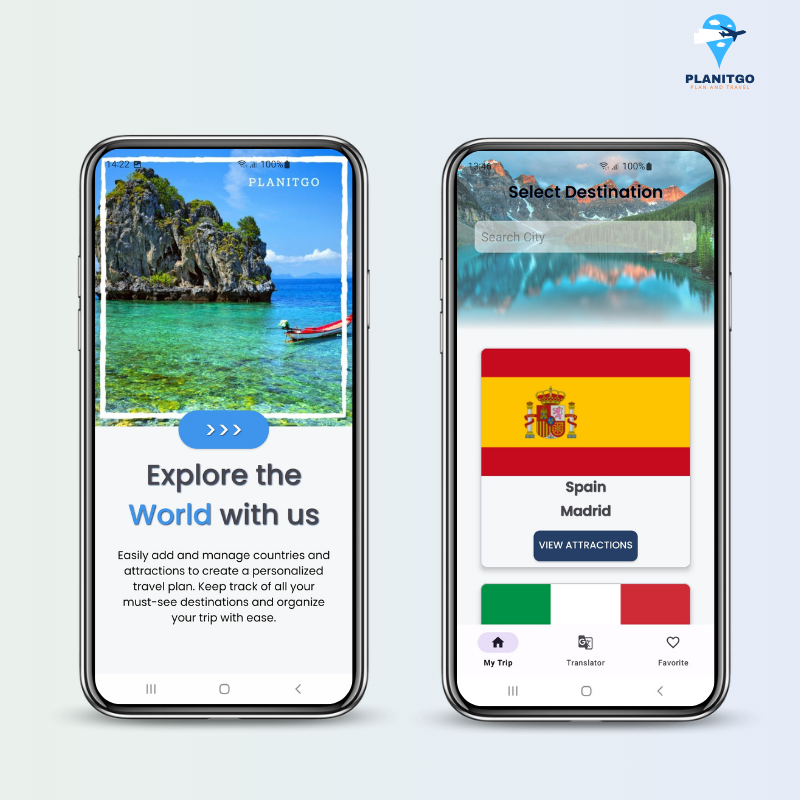
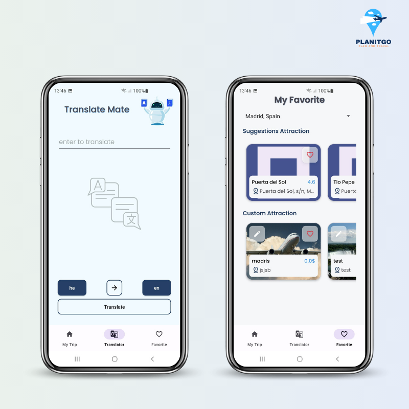
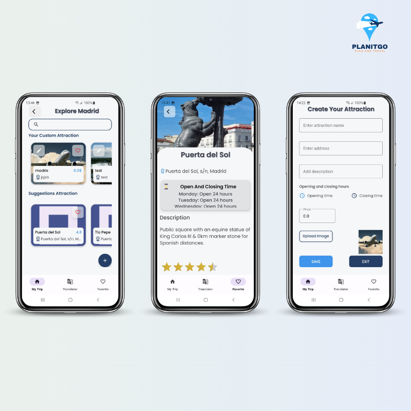

# Plan It Go App 🌍✈️

This is a travel planning app built using Kotlin, designed to help users organize their trips and discover attractions around the world. It offers a personalized and convenient way to plan trips, keep track of activities, and explore new destinations!

### Features 🚀
- **Create New Trip Destinations**: Add new destinations for your travel plans.
- **Attraction Information**: Get details about popular attractions, including operating hours, ratings, and additional information, all retrieved from an API.
- **Custom Attractions**: Add your own attractions to any destination.
- **Personal Translator**: Built-in translation tool to help you communicate with locals during your trip.
- **Favorite Attractions**: Save and organize your favorite attractions for easy access and future planning.

### Language 🌐

  

### Technologies Used 💻
- **Room** for local database storage.
- **MVVM** architecture for a clean, maintainable codebase.
- **Retrofit** for network requests.
- **Repository Pattern** for data management.
- **Hilt** for dependency injection.
- **XML** for user interface design.
- **Coroutines** for asynchronous programming.

### Environment

   

### APIs Used 🌐
The app integrates data from multiple APIs to provide accurate and up-to-date information for users.

### Team 👩‍💻👨‍💻👩‍💻
This project was developed by me and two other collaborators, working together to bring this app to life!

### Demo 🎥
Feel free to check out the screenshots and video demo below to see the app in action!

🎥 [Watch the demo video](https://drive.google.com/file/d/1WHyJrk4K8rVNoNmudnbr-QRztIfo7Iuy/view?usp=drive_link)

### UML Design 📈

